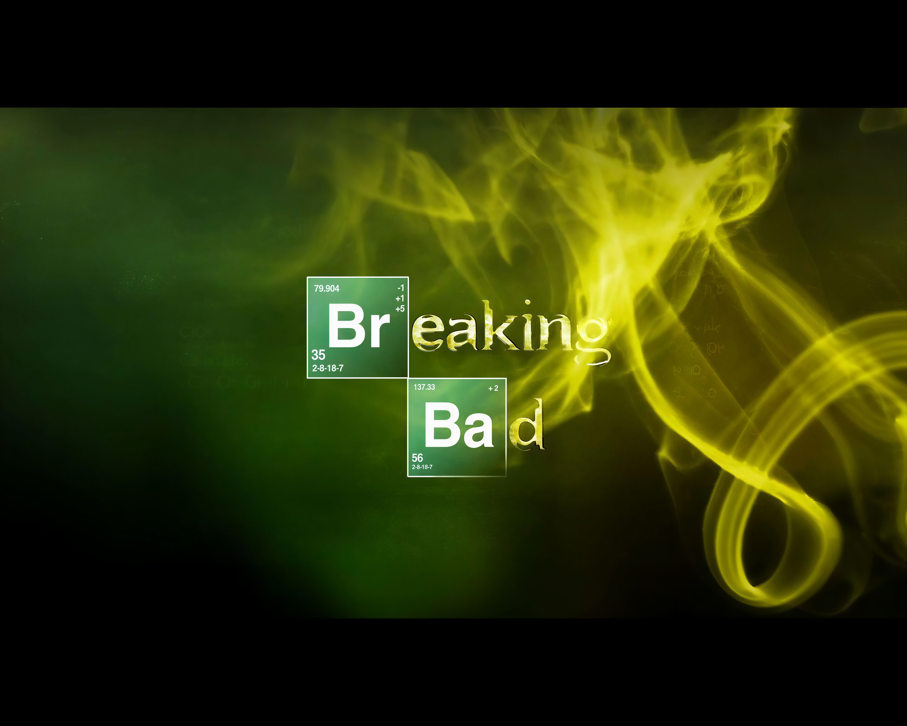
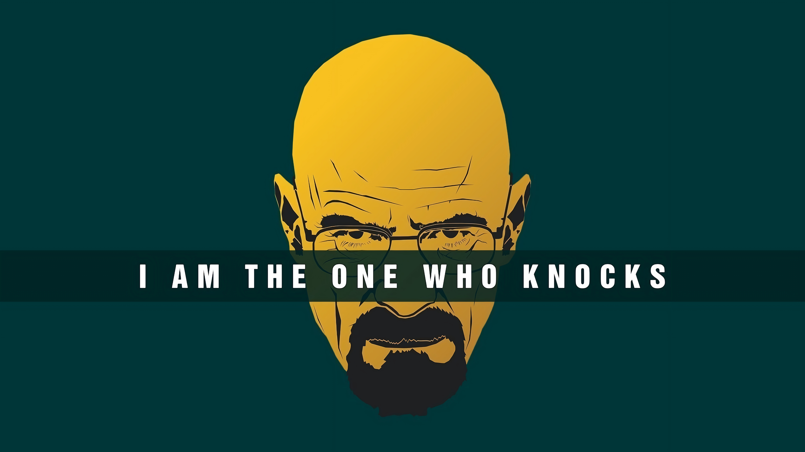
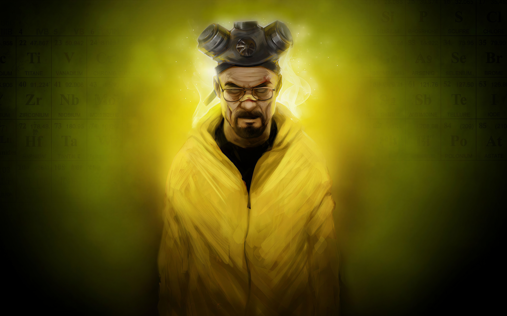
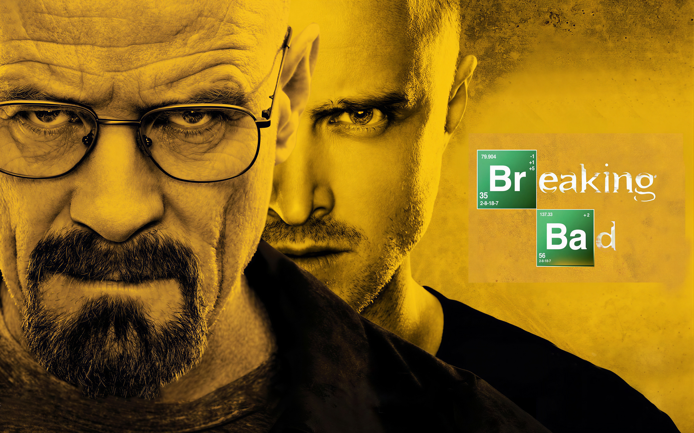
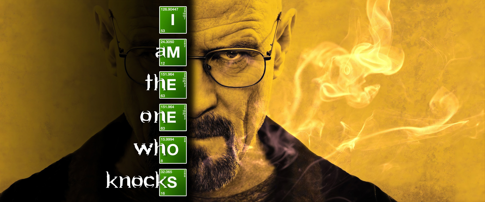

# Omarchy Breaking Bad Theme

A disciplined Omarchy theme built around the chemistry-lab half of Breaking Bad: teal-black work surfaces, meth yellow text, and a restrained orange signal color. It leans closer to IBM Carbon than novelty merch, with square edges, dense overlays, and terminal-first contrast.

## Preview



## Install

Use the Omarchy theme installer:

```bash
omarchy-theme-install https://github.com/oldjobobo/omarchy-breaking-bad-theme
```

## What's Included

- A custom Walker surface with layered lab panels, teal selection rails, and orange signal accents.
- Hyprland and Hyprlock styling tuned around sharp borders, dim inactive windows, blur treatment, and the lock-ring palette.
- Terminal coverage for Foot, Kitty, Ghostty, Alacritty, and Warp, plus matching palettes for Neovim, Zed, GTK, Mako, SwayOSD, and btop.
- A Vencord theme that remaps Midnight Discord into the same lab-void palette.

## Wallpapers

<table>
  <tr>
    <td></td>
    <td></td>
    <td></td>
  </tr>
  <tr>
    <td></td>
    <td></td>
    <td></td>
  </tr>
</table>

## Requirements

- For the intended typography, install IBM Plex with `omarchy-pkg-add ttf-ibm-plex`. The theme still works with sane sans-serif fallbacks if you skip it.
- For the exact icon treatment, install `yaru-icon-theme` with `omarchy-pkg-add yaru-icon-theme`. This theme targets the `Yaru-wartybrown` variant.

## Notes

- The Vencord theme imports Midnight Discord from `https://refact0r.github.io/midnight-discord/build/midnight.css` at runtime instead of vendoring a local copy.
- This repo does not currently ship a dedicated desktop screenshot; the preview above uses one of the bundled wallpapers.
