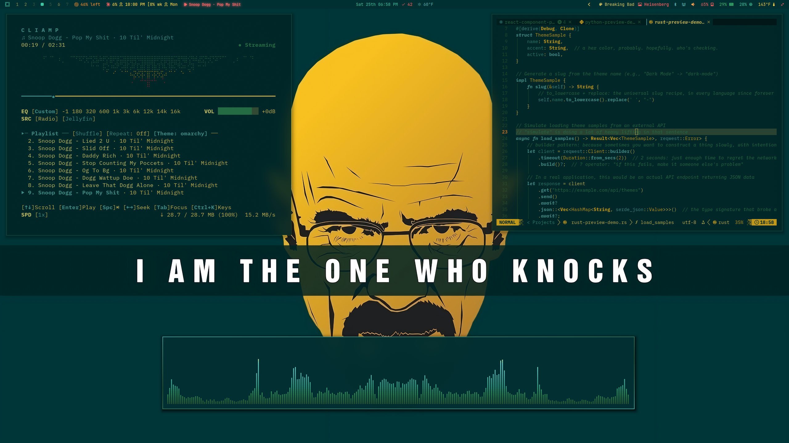
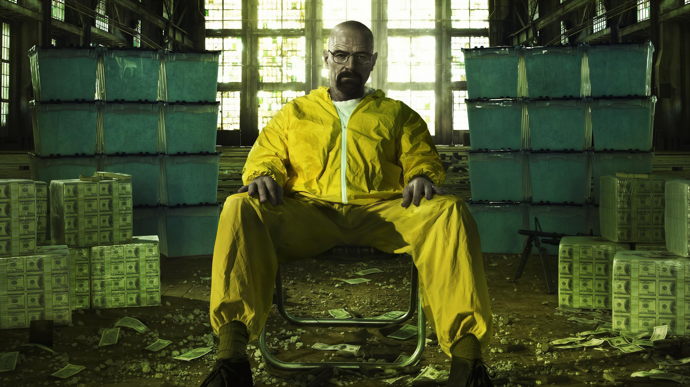
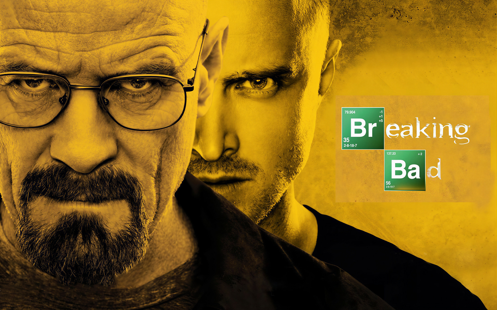

# Omarchy Breaking Bad Theme

Heisenberg's lab was the cleanest place in Albuquerque. This is that aesthetic, applied to a desktop.

The surfaces are teal-black — the cook space at 3am. Text in hazmat yellow. Accents in blue meth cyan, the product. Blood for what it costs. Money for what it's worth. The kind of setup you run when you've stopped pretending to be someone else.

The lab is open. Time to cook!

## Preview



## Install

Use the Omarchy theme installer:

```bash
omarchy-theme-install https://github.com/oldjobobo/omarchy-breaking-bad-theme
```

## What's Included

- A custom Walker surface with layered lab panels, teal selection rails, and orange signal accents.
- Hyprland and Hyprlock styling tuned around sharp borders, dim inactive windows, blur treatment, and the lock-ring palette.
- Terminal coverage for Foot, Kitty, Ghostty, Alacritty, and Warp, plus matching palettes for Neovim, Zed, GTK, Mako, SwayOSD, and btop.
- A Vencord theme that remaps Midnight Discord into the same lab-void palette.

## Wallpapers

<table>
  <tr>
    <td><br><sub>01 Synthesis</sub></td>
    <td><br><sub>02 Empire</sub></td>
    <td><br><sub>03 Heisenberg</sub></td>
  </tr>
  <tr>
    <td><br><sub>04 Partners</sub></td>
    <td><br><sub>05 Say My Name</sub></td>
    <td><br><sub>06 The One Who Knocks</sub></td>
  </tr>
</table>

## Requirements

- For the intended typography, install IBM Plex with `omarchy-pkg-add ttf-ibm-plex`. The theme still works with sane sans-serif fallbacks if you skip it.

## Notes

- The Vencord theme imports Midnight Discord from `https://refact0r.github.io/midnight-discord/build/midnight.css` at runtime.

